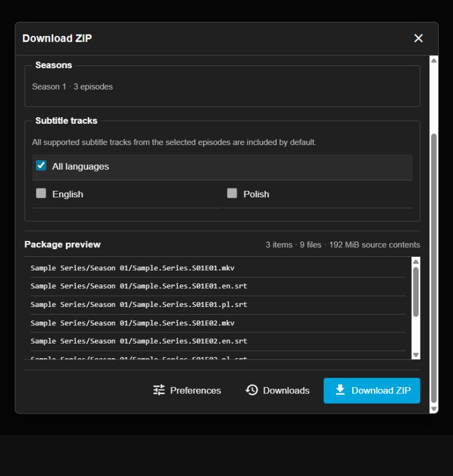

# Zipper

Download movies, episodes, seasons, and series from Jellyfin as a ZIP, with their external subtitles included.

Zipper adds **Download ZIP** to Jellyfin Web's media menus and detail pages. Choose what to include, check the files, and download.

## Features

- Download a whole season or series in one ZIP.
- Include all associated external subtitles, or choose specific tracks and languages.
- Download media and subtitles together, media only, or subtitles only.
- Keep original filenames and file contents, including embedded tracks.
- Stream directly to your browser without transcoding or storing an archive on the server.
- Save preferences to your Jellyfin account, cancel downloads, and retry interrupted transfers.

## Getting started

Requires **Jellyfin Server and Web 12.0.0** and [File Transformation](https://github.com/IAmParadox27/jellyfin-plugin-file-transformation) **3.0.1.0**.

See the [installation guide](docs/installation.md).

## Preview

Screenshots use sample titles and filenames.

## Contributing

Bug reports, translations, and contributions are welcome. See [Contributing](CONTRIBUTING.md), [theme styling](docs/styling.md), or [report an issue](https://github.com/T9es/Zipper/issues). Please report security issues [privately](SECURITY.md).

## License

[GPL-3.0-only](LICENSE).
